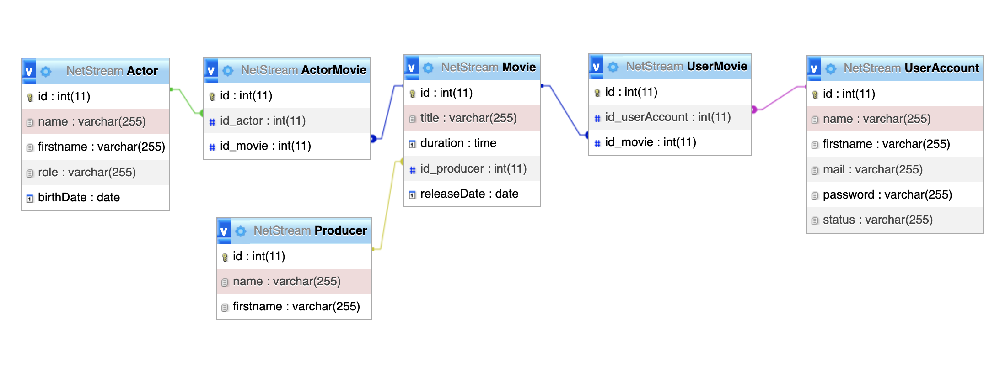

# Netsteam database

````                                                                             
  ,----..      ,---,       ,---,                                         ,--,    
 /   /   \   .'  .' `\    '  .' \                     ,---.            ,--.'|    
|   :     :,---.'     \  /  ;    '.                  /__./|            |  | :    
.   |  ;. /|   |  .`\  |:  :       \            ,---.;  ; |            :  : '    
.   ; /--` :   : |  '  |:  |   /\   \          /___/ \  | |   ,--.--.  |  ' |    
;   | ;    |   ' '  ;  :|  :  ' ;.   :         \   ;  \ ' |  /       \ '  | |    
|   : |    '   | ;  .  ||  |  ;/  \   \         \   \  \: | .--.  .-. ||  | :    
.   | '___ |   | :  |  ''  :  | \  \ ,'          ;   \  ' .  \__\/: . .'  : |__  
'   ; : .'|'   : | /  ; |  |  '  '--'             \   \   '  ," .--.; ||  | '.'| 
'   | '/  :|   | '` ,/  |  :  :                    \   `  ; /  /  ,.  |;  :    ; 
|   :    / ;   :  .'    |  | ,'                     :   \ |;  :   .'   \  ,   /  
 \   \ .'  |   ,.'      `--''                        '---" |  ,     .-./---`-'   
  `---`    '---'                                            `--`---'             
````

## Instructions
Cloner ce repo  
Se placer dans le dossier dans un terminal  
Lancer : '''' docker compose up ''''  
Ouvrir localhost:8000

## Stacks
**#1**  
mySQL  
phpMyAdmin  
  
**#2**  
Postgres  
Dbeaver  

## Convention
Entity in PascalCase  
Attributes in Camelcase

## Dictionary
**Movie**  
id, title, duration, producer#, releaseDate  
**Actor**  
id, name, firstname, role, birthDate  
**Producer**  
id, name, firstname  
**UserAccount**  
id, name, firstname, mail, password, status  
**ActorMovie**  
id, actor#, movie#, isMain  
**UserMovie**  
id, userAccount#, movie#  
  
## MCD
> TODO  
  
## MLD
> TODO  

## MPD



## Queries
  
Selectionner tout les films
````
SELECT * FROM Movie
````

## Grille de correction

modèle(s) de données /10  
deployabilité /5  
requête /3  
trigger /1  
procédure stockée /1  
  
## Question ?
<tvinchent@gmail.com>